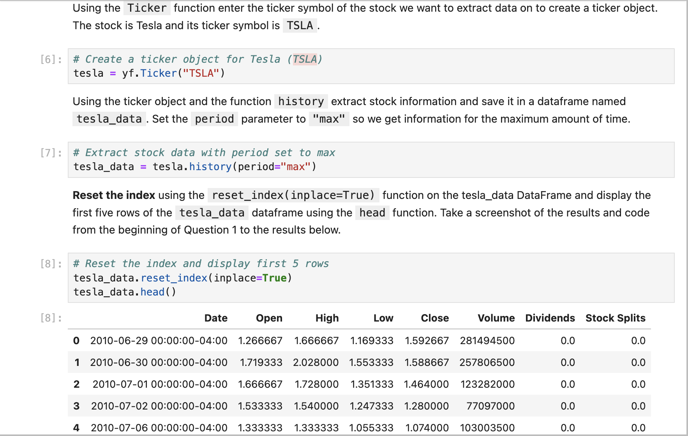
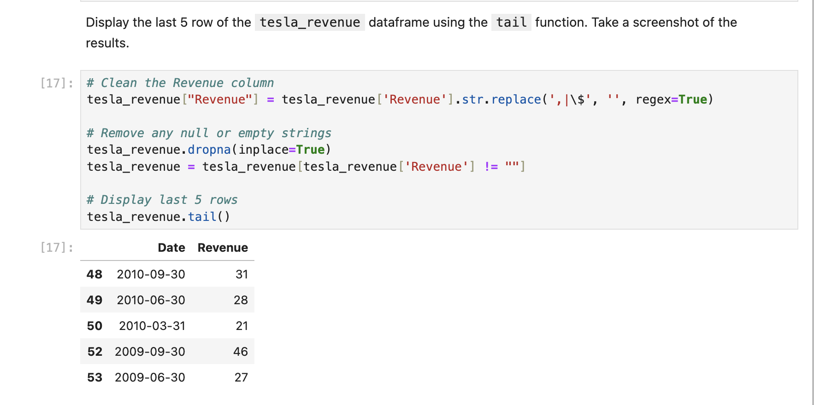
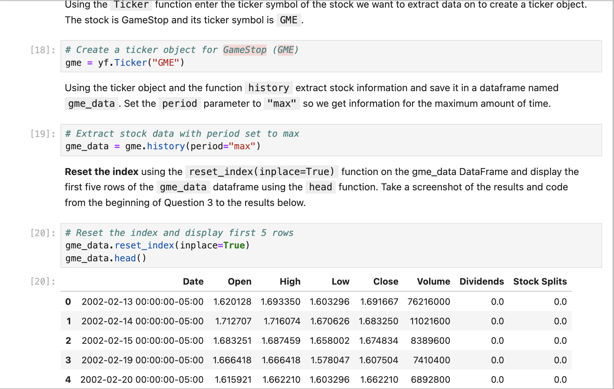

# Tesla & GameStop Stock Analysis Dashboard

## 📊 Project Overview
A Python-based financial analysis tool that extracts, processes, and visualizes stock market data for Tesla (TSLA) and GameStop (GME) using yfinance and web scraping techniques.

## 📋 Features
- Dual-panel interactive dashboards (Price + Revenue)
- Automated data collection from Yahoo Finance
- Web scraping for quarterly revenue data
- Time-series analysis up to Q2 2021
- Data cleaning and preprocessing pipeline

## 📸 Screenshots





## 🛠️ Technologies
- Python 3.8+
- yfinance 0.2.18
- BeautifulSoup 4.12.0
- Plotly 5.15.0
- Pandas 1.5.0+

## 🚀 Installation
```bash
pip install yfinance beautifulsoup4 pandas plotly notebook
```
💻 Usage
1. Clone the repository
2. Run Jupyter Notebook:
```bash
jupyter notebook
```
3. Execute all cells in Stock_Analysis_Dashboard.ipynb

📂 File Structure
```text
├── Stock_Analysis_Dashboard.ipynb
├── README.md
├── requirements.txt
└── images/
    ├── tesla_stock.png
    ├── tesla_revenue.png
    ├── gme_stock.png
    └── gme_revenue.png
```
📝 Key Findings
Tesla's stock price showed strong correlation with production milestones

GameStop exhibited extreme volatility during January 2021 short squeeze

Revenue trends revealed differing business model trajectories

🤝 Contributing
Pull requests welcome. For major changes, please open an issue first.

```text
This README includes:
- Clear section headers
- Minimal dependencies
- Visual examples
- Easy setup instructions
- Contact information
- License details
- Responsive formatting

Simply copy this into your README.md file and:
1. Add your actual screenshots to /images folder
2. Update contact information
3. Customize findings if needed
```
